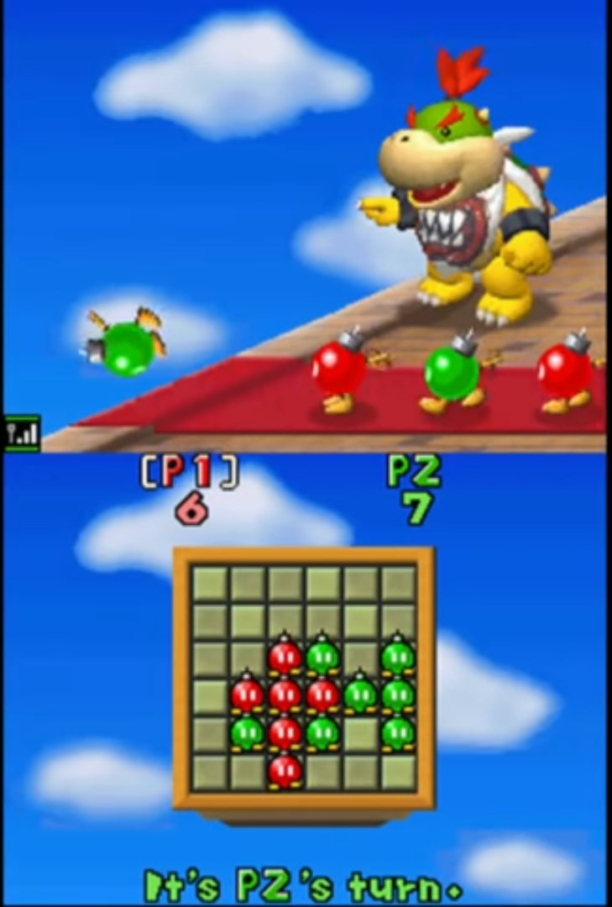
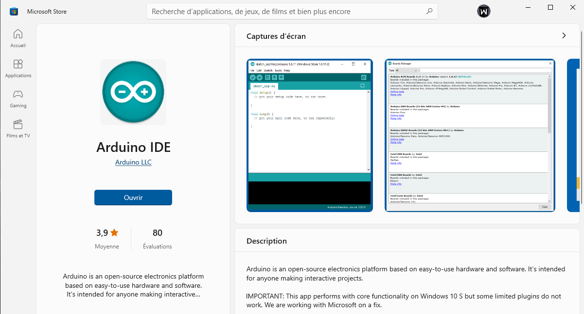
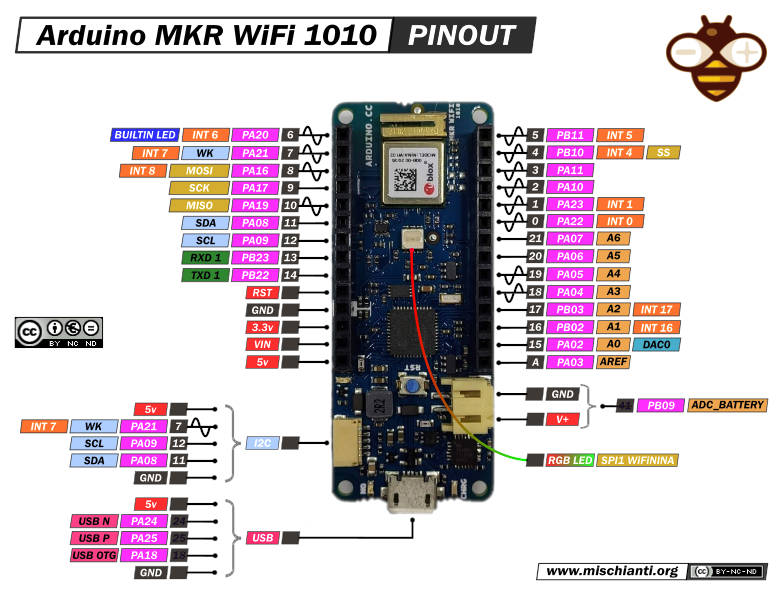
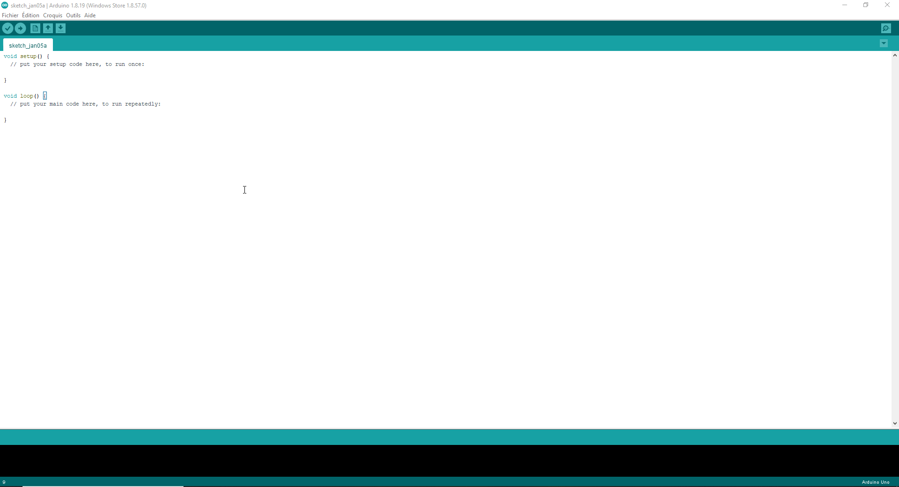
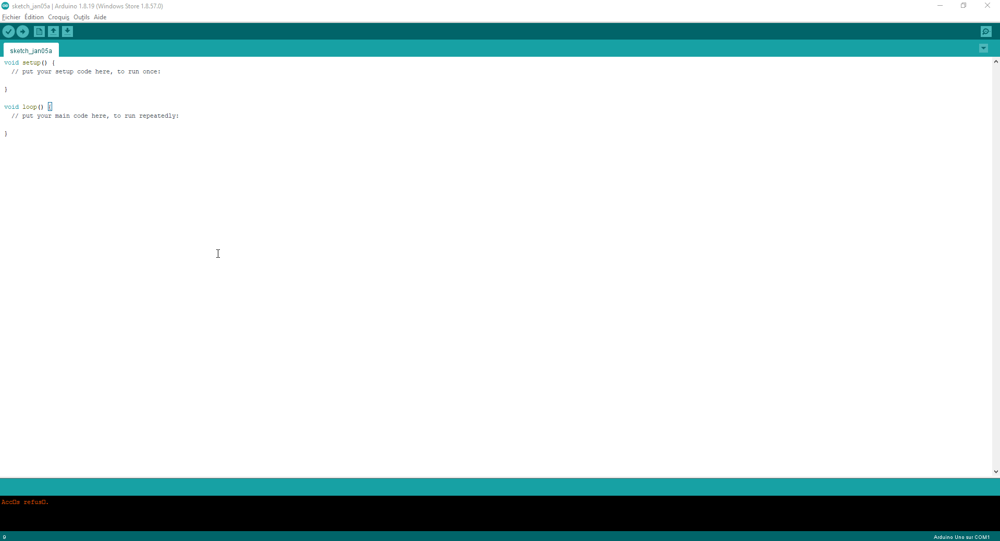
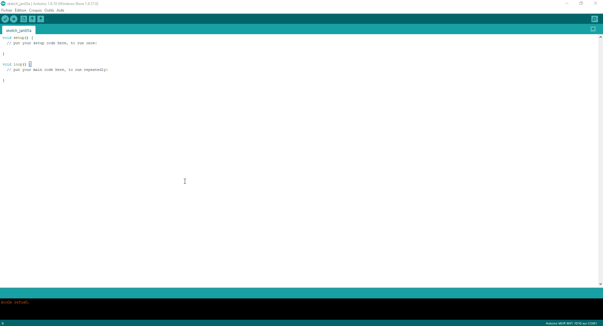
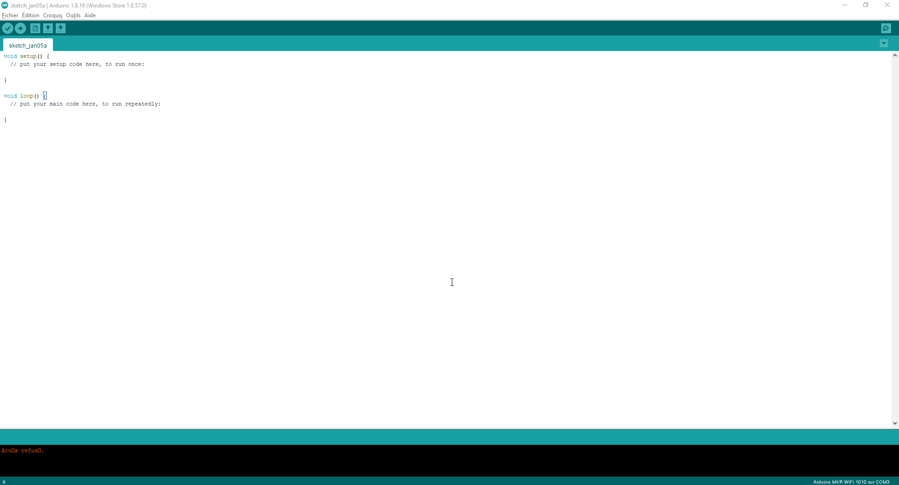

# Bob-omb Reverse with Arduino MKR 1010 Wifi
> @cbarange & @j-peguet | 5th January 2022
---

Place your Bob-ombs so they surround opposing Bob-ombs. Captured Bob-ombs change color and join your team. The player uith the most Bob-ombs at the end is the Hinner.

## Setup

### First Install Arduino IDE

### Arduino MKR 1010 Wifi PinOut

### Install Board Dependencies

> Outils > Type de Cartes > Gestionnaire de carte > Arduino SAMD Boards (32-bits ARM Cortex-M0+)

### Plug board (plug usb cable)

> Outils > Type de Cartes > Arduino SAMD Boards (32-bits ARM Cortex-M0) > Arduino MKR Wifi 1010

### Install Wifi Dependencies

> Outils > Gérer les bibliothèques > WifiNINA

### Validate installation with Serial Example

