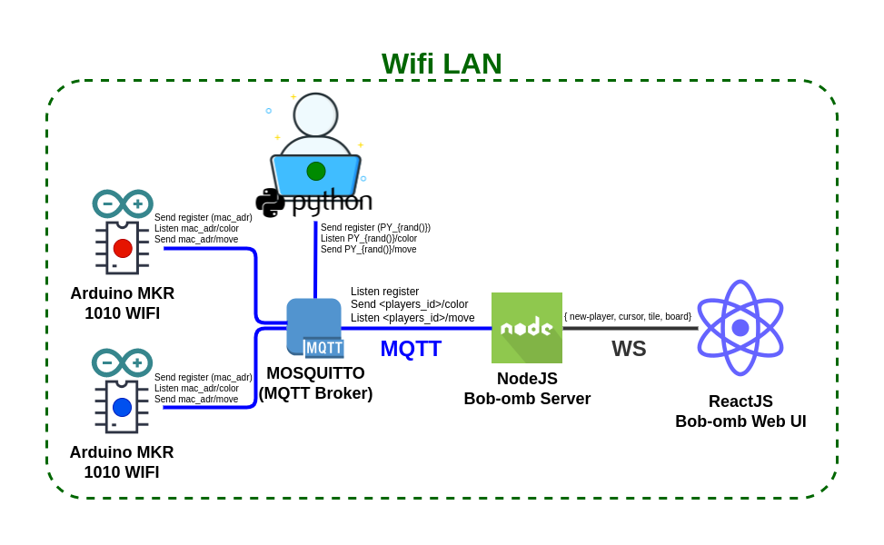
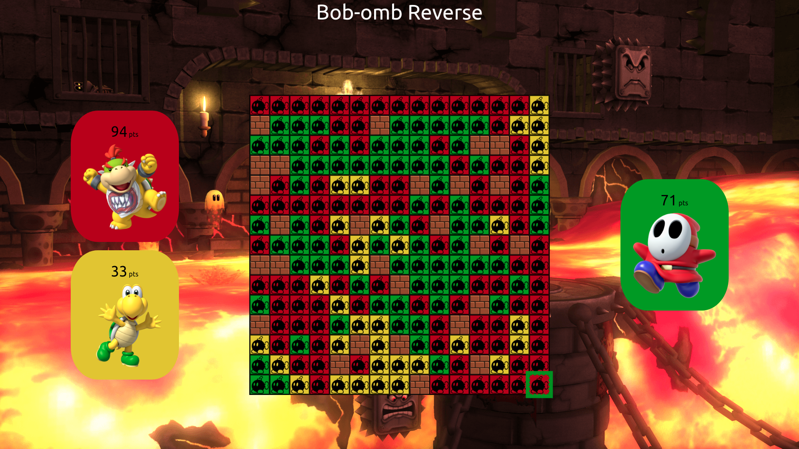
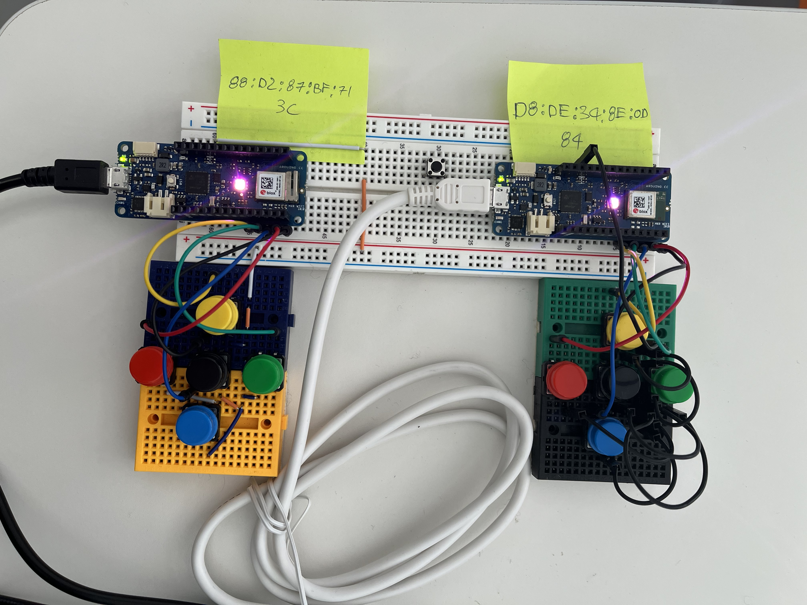
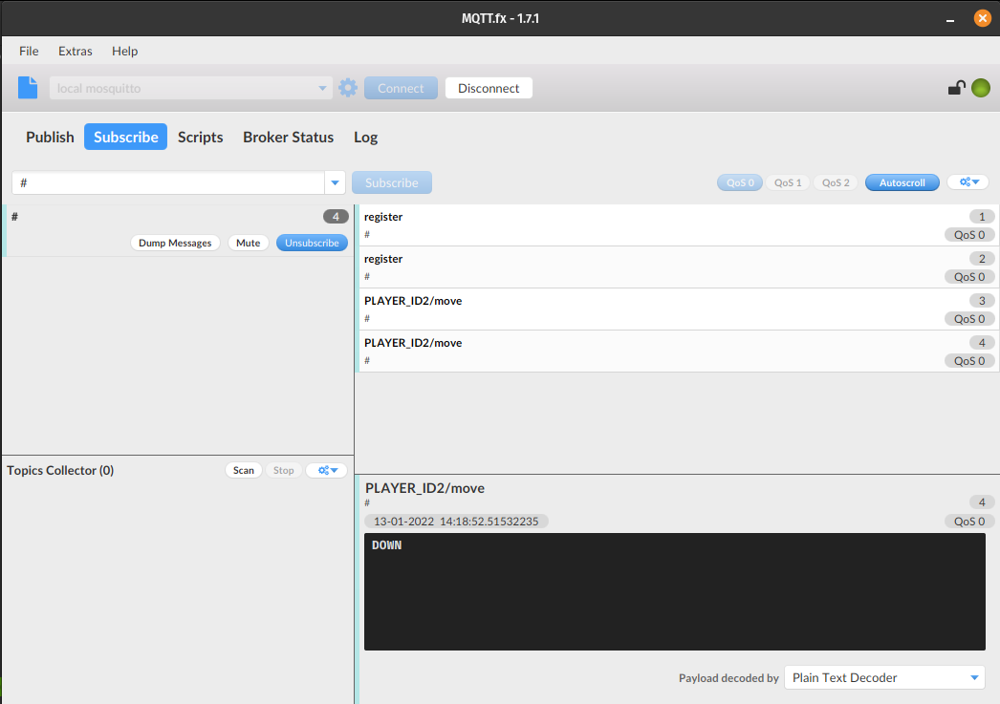
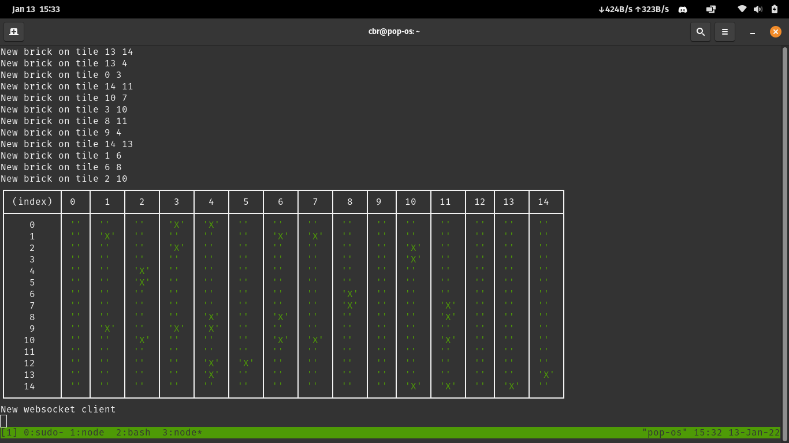
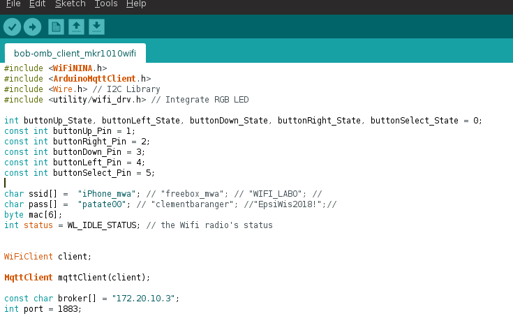
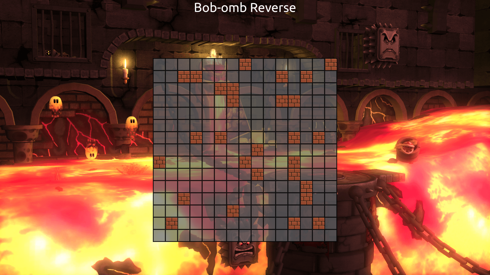

# Bob-omb Reverse with [Arduino MKR 1010 Wifi](https://docs.arduino.cc/hardware/mkr-wifi-1010/)
> 🐦 [@cbarange](https://twitter.com/cbarange_dev) & [@j-peguet](https://twitter.com/j_peguet) | 5th January 2022
---

## Intro




**Docs**
MQTT with Arduino 👉 https://docs.arduino.cc/tutorials/mkr-wifi-1010/mqtt-device-to-device


**See how to play a game 👇**

[](https://www.youtube.com/watch?v=c6gmPTDR9IY)

> https://www.youtube.com/watch?v=c6gmPTDR9IY

## The Game

Place your Bob-ombs so they surround opposing Bob-ombs. Captured Bob-ombs change color and join your team. The player uith the most Bob-ombs at the end is the Hinner.




## Setup

### First Install Arduino IDE


### Arduino MKR 1010 Wifi PinOut




### Install Board Dependencies

> Outils > Type de Cartes > Gestionnaire de carte > Arduino SAMD Boards (32-bits ARM Cortex-M0+)


### Plug board (plug usb cable)

> Outils > Type de Cartes > Arduino SAMD Boards (32-bits ARM Cortex-M0) > Arduino MKR Wifi 1010


### Install Wifi Library

> Outils > Gérer les bibliothèques > WifiNINA


### Install ArduinoMqttClient Library

> Outils > Gérer les bibliothèques > ArduinoMqttClient


### Validate installation with Serial Example


### Install MQQT Broker

```bash
# - Open port between Windows and WSL -
# In Powershell admin
netsh interface portproxy add v4tov4 listenport=3000 listenaddress=0.0.0.0 connectport=3000 connectaddress=172.25.13.92 #←WLS IP

# In WSL install mqtt broker
sudo apt install -y mosquitto mosquitto-clients
systemctl status mosquitto

sudo nano /etc/mosquitto/mosquitto.conf
# allow_anonymous false
# listener 1883 0.0.0.0
systemctl restart mosquitto

mosquitto_pub -h 192.168.0.12 -p 3000 -t sensor/temperature -m 22.5 # -u user -P pass -r r indique au broker de retenir (ou pas) le message
mosquitto_sub -h 192.168.0.12 -p 3000  -t "sensor/temperature"
```

### Install [MQTT Fx](https://mqttfx.jensd.de/) (MQTT tools, optional)

> Download link 👉 http://www.jensd.de/apps/mqttfx/1.7.1/



### Install Nodejs server (Listen MQTT and Send to Front Web UI with Websocket)

```bash
cd bob-omb_server_nodejs
yarn install # Install Yarn with sudo apt install nodejs npm && npm i -g yarn
yarn dev
```




### Flash Bob-omb Arduino Client

1. Open file `bob-omb_client_mkr1010wifi/bob-omb_client_mkr1010wifi.ino` with Arduino IDE 
2. Edit Wifi SSID and MQTT Broker configuration (ssid[], pass[], broker[], port)

3. Flash board

### Install and Run WEB UI

```bash
cd bob-omb_graphic_reactjs
yarn install # Install Yarn with sudo apt install nodejs npm && npm i -g yarn
yarn start
# Open web browser on http://localhost:3000
```



### Press RESET button on arduino boards and wait util their LED turn Red,Green,Blue or Yellow

* If LED is white, arduino try to connect to wifi
* If LED is pink, arduino try to connect to mqtt broker
* You can check serial output for debuging

### Have fun 🎮 🔴 🔵 👾