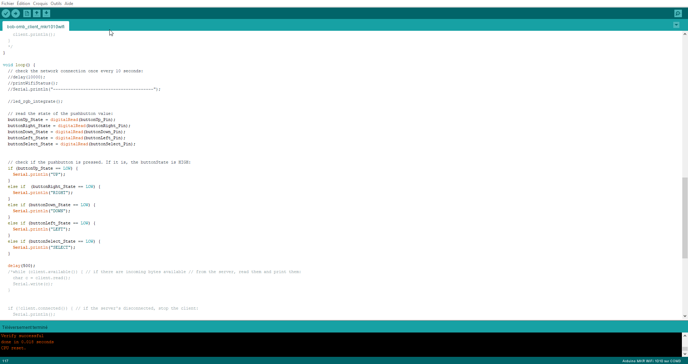

# Bob-omb Reverse with Arduino MKR 1010 Wifi
> @cbarange & @j-peguet | 5th January 2022
---

Place your Bob-ombs so they surround opposing Bob-ombs. Captured Bob-ombs change color and join your team. The player uith the most Bob-ombs at the end is the Hinner.


## Setup

### First Install Arduino IDE


### Arduino MKR 1010 Wifi PinOut


### Install Board Dependencies

> Outils > Type de Cartes > Gestionnaire de carte > Arduino SAMD Boards (32-bits ARM Cortex-M0+)


### Plug board (plug usb cable)

> Outils > Type de Cartes > Arduino SAMD Boards (32-bits ARM Cortex-M0) > Arduino MKR Wifi 1010


### Install Wifi Library

> Outils > Gérer les bibliothèques > WifiNINA


### Install ArduinoMqttClient Library

> Outils > Gérer les bibliothèques > ArduinoMqttClient



### Validate installation with Serial Example


### Install MQQT Broker

```bash
# In Powershell admin
netsh interface portproxy add v4tov4 listenport=3000 listenaddress=0.0.0.0 connectport=3000 connectaddress=172.25.13.92 #←WLS IP
# In WSL
sudo apt install -y mosquitto mosquitto-clients python-mosquitto
systemctl status mosquitto
sudo systemctl enable mosquitto.service

sudo mosquitto_passwd -c /etc/mosquitto/passwd USERNAME
sudo nano /etc/mosquitto/mosquitto.conf
# allow_anonymous false
# password_file /etc/mosquitto/passwd
# listener 3000


systemctl restart mosquitto

mosquitto_pub -h 192.168.0.12 -p 3000 -t sensor/temperature -m 22.5 # -u user -P pass -r r indique au broker de retenir (ou pas) le message
mosquitto_sub -h 192.168.0.12 -p 3000  -t "sensor/temperature"

```